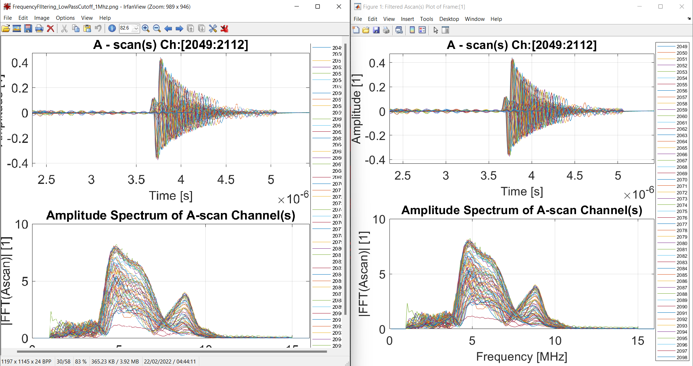

# MATLAB-convert-fig-2-eps-or-png

Desctiption: MATLAB function to convert figure files to eps or png and other. There are multiple options available such as changing fonts and expanding or normalizing the figure window. If extra processing is needed it can be done on via internal call function for batch processing.
The function can take a directory or a file name or multiple directories. It will comple alist of all \*.fig files found and convert them one by one in the in the corresponding location of the original file.

Usecase Example: This is great for use with LATEX where the data can be updated and the function can be called to generate new/updated eps and png files at the same time (call the function twice). Then LATEX is called to generate the new PDF file.

Example image:
